# What is internet?
The Internet is a large network of computers which communicate all together.
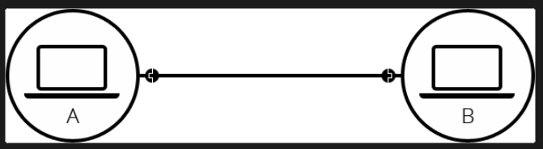

Many computers can connect to a router which serves as a bridge for communication between all connected computers. Routers can greatly reduce number of cables needed. 
Routers can connect to other routers which can be connected to ISP(internet serivice providers).An ISP is a company that manages some special routers that are all linked together and can also access other ISPs' routers. So the message from our network is carried through the network of ISP networks to the destination network. The Internet consists of this whole infrastructure of networks.

# How the web works?
### Client and Servers
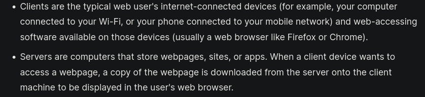

In addition to client and servers there are other several moving parts.

Internet Connection
: Allows you to send and receive data on the web.

TCP/IP
: Transmission Control Protocol and Internet Protocol are communication protocols that define how data should travel across the internet.

DNS
: Domain Name System is like an address book for websites. When you type a web address in your browser, the browser looks at the DNS to find the website's IP address before it can retrieve the website. The browser needs to find out which server the website lives on, so it can send HTTP messages to the right place (see below).

HTTP
: Hypertext Transfer Protocol is an application protocol that defines a language for clients and servers to speak to each other.

Component Files
: A website is made up of many different files.
: Code files
    : Websites are built primarily from HTML, CSS, and JavaScript, though you'll meet other technologies a bit later.
: Assets
    : This is a collective name for all the other stuff that makes up a website, such as images, music, video, Word documents, and PDFs.

### How Component files are parsed
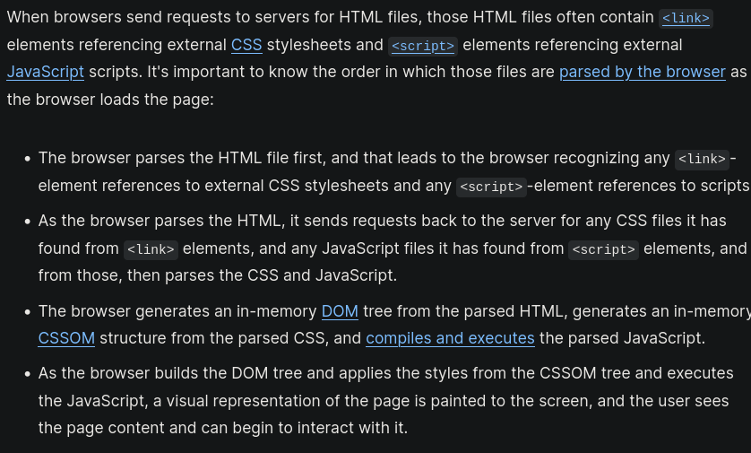

## Understanding Domain name
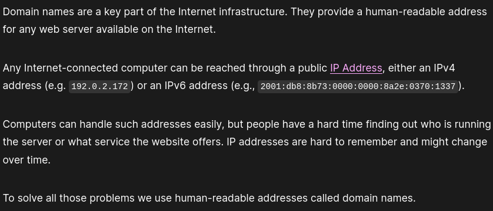

Structure of Domain name
: 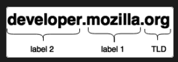

TLDs
: 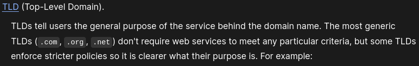

Label
: 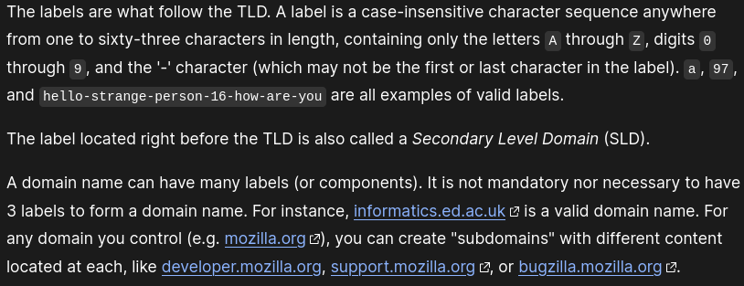

Who owns a Domain name?
: 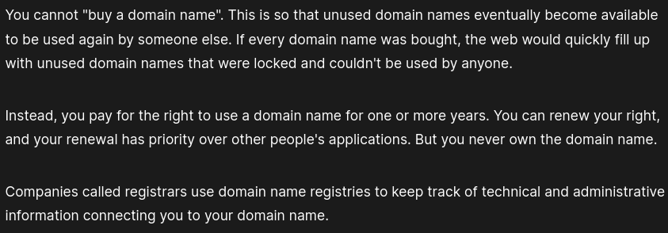

To check which domain is available we can use a shell command called `whois`
: 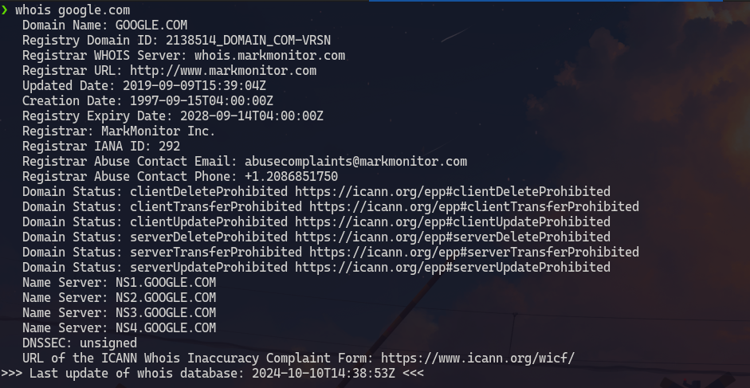 
  
  Or we can check at any Domain name registrar's website such as domain.com , hostinger.com and many more.

How to acquire a domain name?
: Go to a registrar's website. Fill out the important details such as name of our domain. If the domain is available we can pay for it. The registrar will then let us know when out domain name is properly registered i.e all DNS servers will have received our DNS information. 

Types of DNS servers
: - recursive resolvers.
  - root nameservers
  - TLD name servers
  - authoritative name servers

  In a typical DNS lookup (the process through which human-readable domain names are translated into a computer-readable IP address) these four DNS servers work in harmony to complete the task of delivering the IP address for a specified domain.

  Recursive resolver
  : 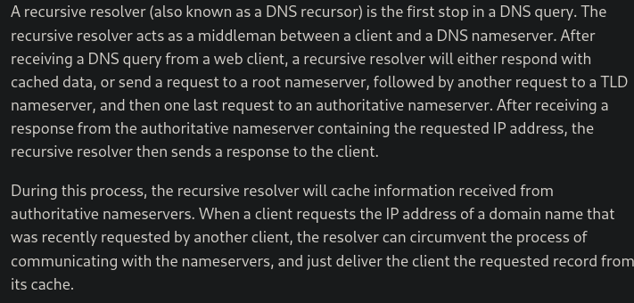

  Rootname servers
  : There are a total of 13 rootname servers around the world (https://en.wikipedia.org/wiki/Root_name_server)
  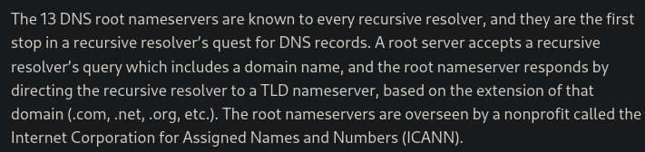
  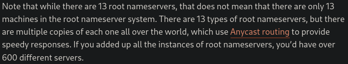

  : Anycast is a network adressing method in which incomming requests can be routed to a variety of different locations or nodes.

  TLD nameservers
  : 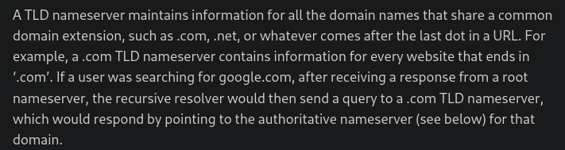
    TLD name servers are handled by the Internet Assigned Numbers Authority (IANA), which is a branch of ICANN. 

  Authoritative nameservers
  : 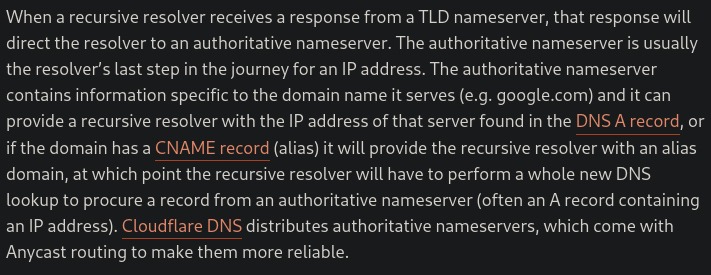

  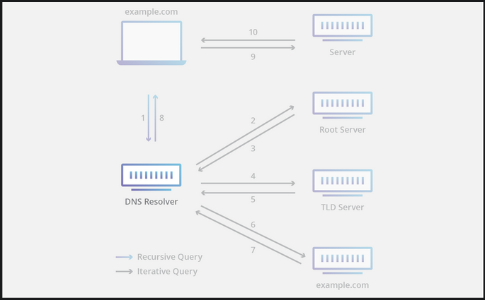  
&nbsp;
&nbsp;
&nbsp;
### Difference between Websites, Webpages, web server and search engine
Web page
: It is a simple document displayed by a web browser. Such doucemnts are written in HTML language. It can also embedd variety of different resources such as style information, scripts, media. 
All web pages available on the web are reachable through a unique address.

Website
: It is a collection of linked web pages that share a unique domain name. A website can have only one web page.

Webserver
: It is a computer that stores web pages and their supporting document. It will send out the web page along with its resources to a users browser as per request. It can host multiple websites at a time.

Search engine
: It is a website that is used to search web pages from other websites.

### Web server
The term web server can refer to hardware or software or both of them working together.
1. On the hardware side a web server is a computer that stores web server software and a website's component files(html, css, javascript)
2. On the software side a web server includes several parts that control how web users access hosted files. At a minimum this is an HTTP server.
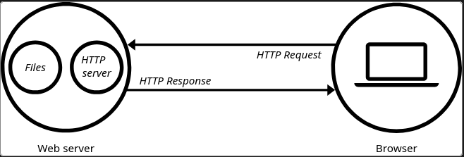

Static and Dynamic webserver
: 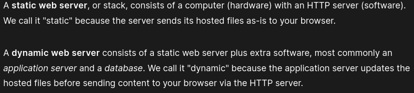

Hosting files
: 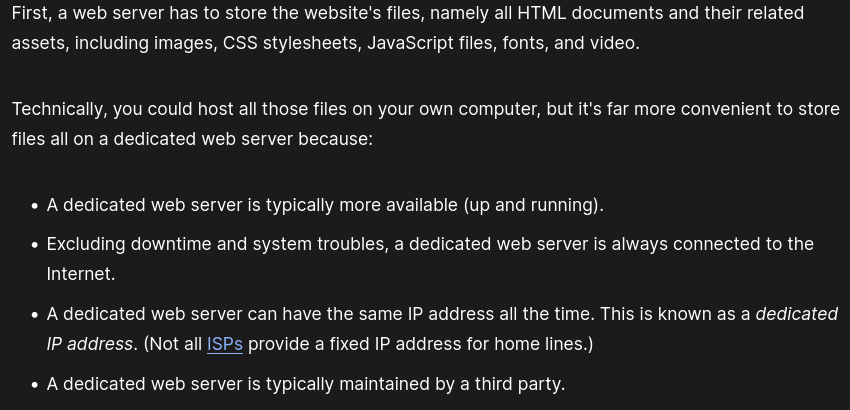

Communicating Through HTTP
: 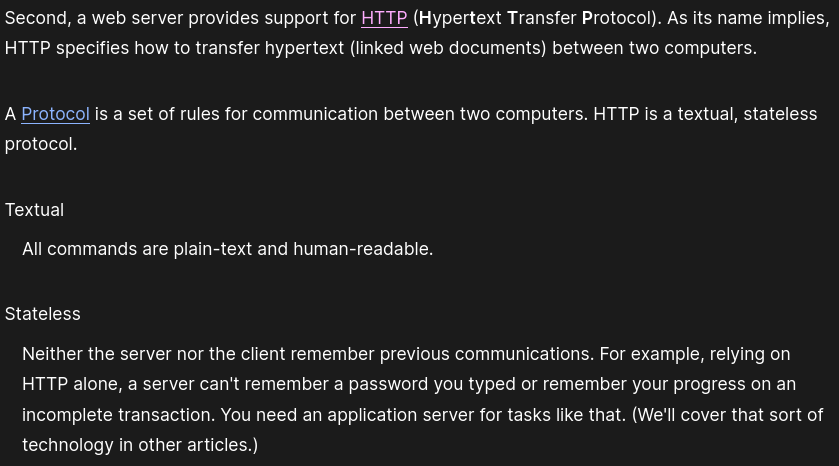

How an HTTP response and request is handled by client and server?
: Client
   : 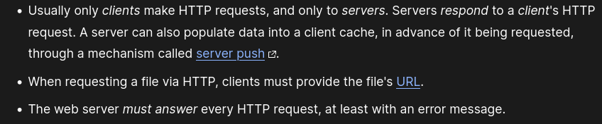
: Server
    : 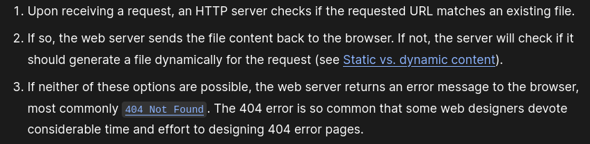

### Sources
[mdn](https://developer.mozilla.org/en-US/)
[cloudflare](https://www.cloudflare.com/learning/dns/dns-server-types/)
