### Installing git
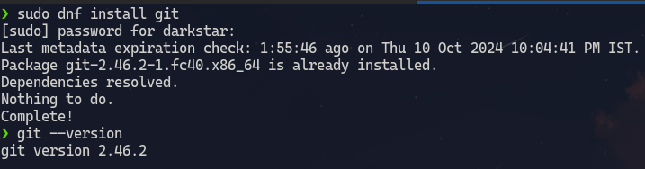

### Configuring git
`$ git config --list`
   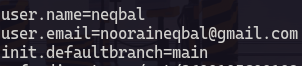
   
### Creating ssh Key
(My ssh key is already setup)
    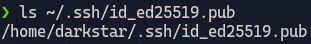

To create an ssh key we have to enter `$ ssh-keygen -t ed25519` in the terminal

### Linking my ssh key with github
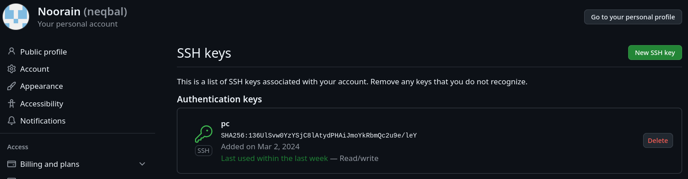

### Testing my ssh connection
`$ ssh -T git@github.com`
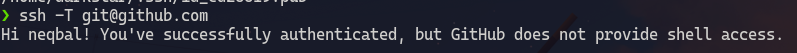
&nbsp;
&nbsp;
&nbsp;
&nbsp;
### What is Git?
Git is a version control system.
A version control is a system that records changes made to files overtime so that we can recall specific versions later.

I will create a local git repository to show what is git and how it can be usefull.

`$ git init` To initialise an existing directory as git repository.
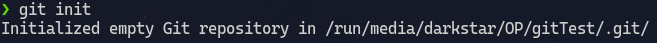
this command creates a `.git` folder inside the directory.
&nbsp;
`$ git status` show modified files in git repo(repository)
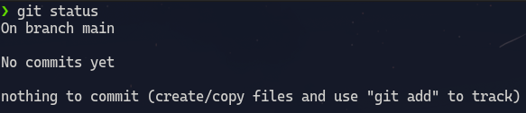

Create a file using `$ touch temp.txt` command
Check git status again
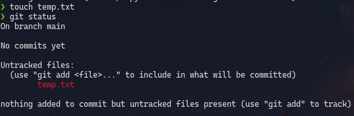

Untracked files are those files which are not currently tracked by git or are not monitored for any change.

`$ git add temp.txt` adds a file as it looks now for the next commit or gets the file ready for git so that it can track it.
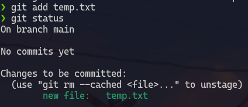

`$ git commit -m "[descriptive message]"` to commit our added files.
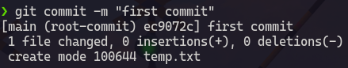
&nbsp;
&nbsp;
Now when we make some changes to our temp.txt file git will track those changes.
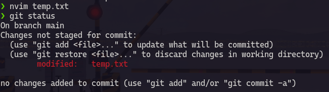
`$ git diff` shows what changes have been to a file that is not yet staged for commit
`$ git diff --staged` shows what changes have been made to a file that is staged for commit
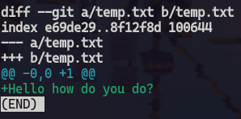

staging and commiting this changed file
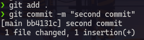

`$ git log` shows all commits made 
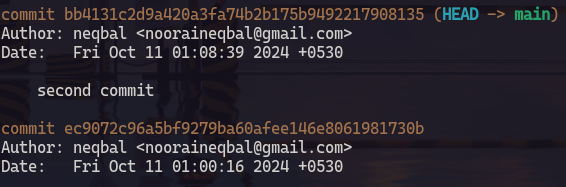

`$git show <commit-hash>` shows specifically what was changed
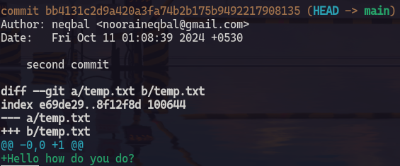

So in a nutshell we can track what was changed, when it was changed and by whom by using git.
we can even recover changes.
This tool can be very handy while creating large projects or while working in a team.

### What is github?
Git is a software that operates locally i.e it keeps track of only the changes made in a local system.
GitHub is a cloud-based platform where we can upload our git tree.
By Storing our code in a "repository" on github we can
- Showcase our work
- Track and manage changes made over time
- Let others review our work
- Collaborate on a shared project

How do git and github work together?
: 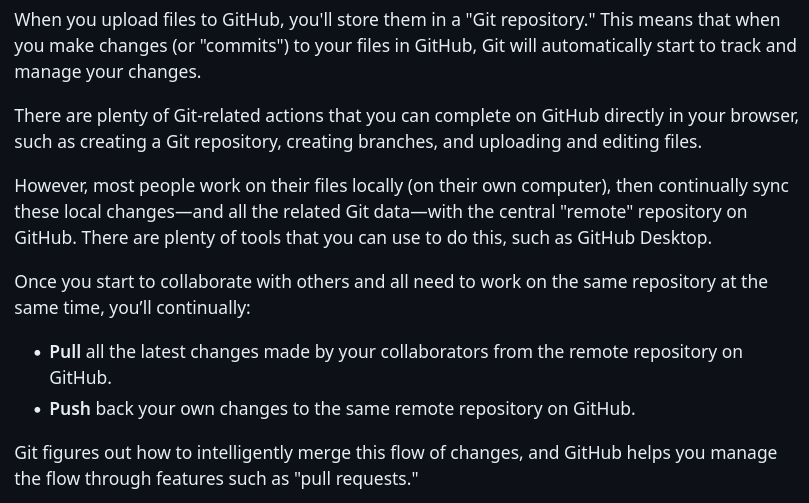

Uploading my local git repository to github
: Step 1
    : Create a remote repository on github.
    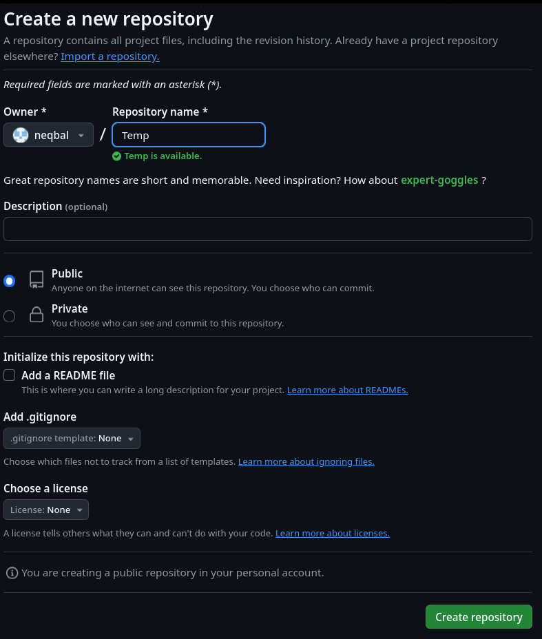
: Step 2
    : add remote repository using `$ git remote add origin <url>`
    
    We can confirm this by using `$ git remote -v`
    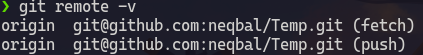
: Step 3 
    : Push local repository `$ git push -u origin`
    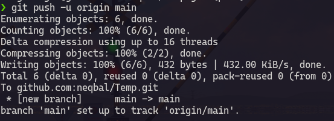

    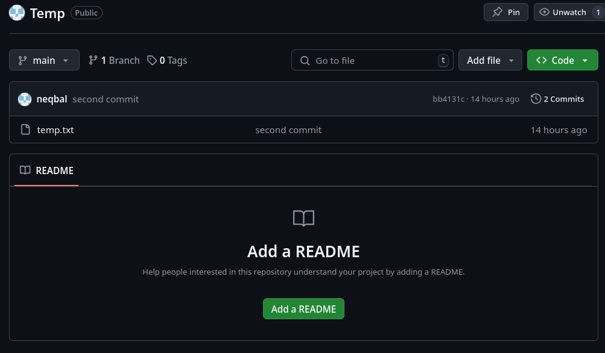
    
### Sources
[Github](https://docs.github.com/en/get-started/start-your-journey/about-github-and-git)
[Git](https://git-scm.com/about/branching-and-merging)
